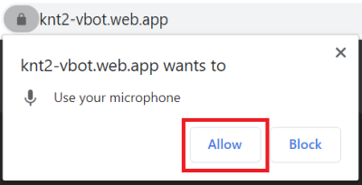
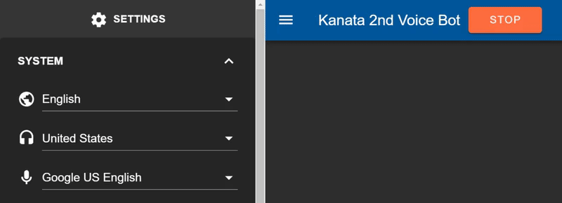
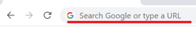
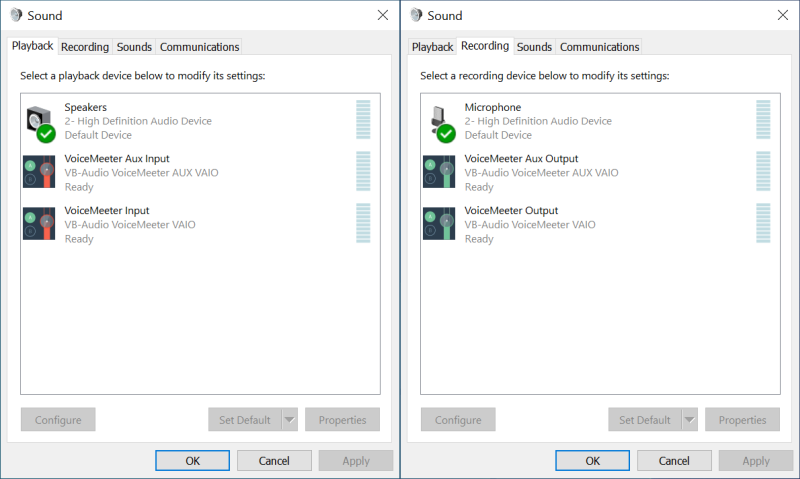
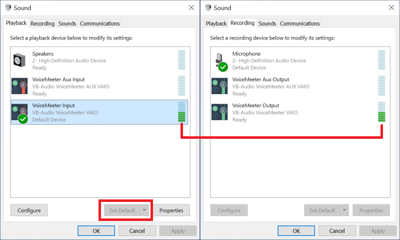
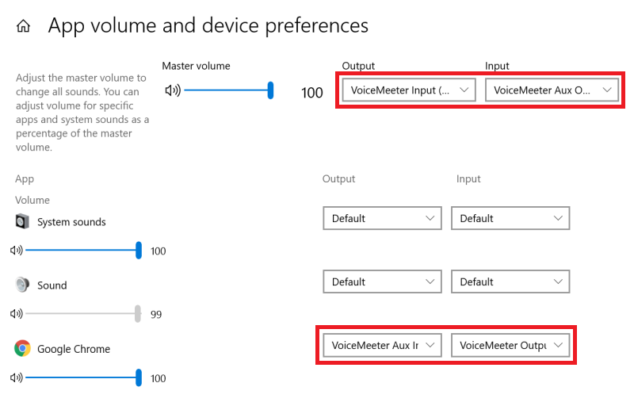
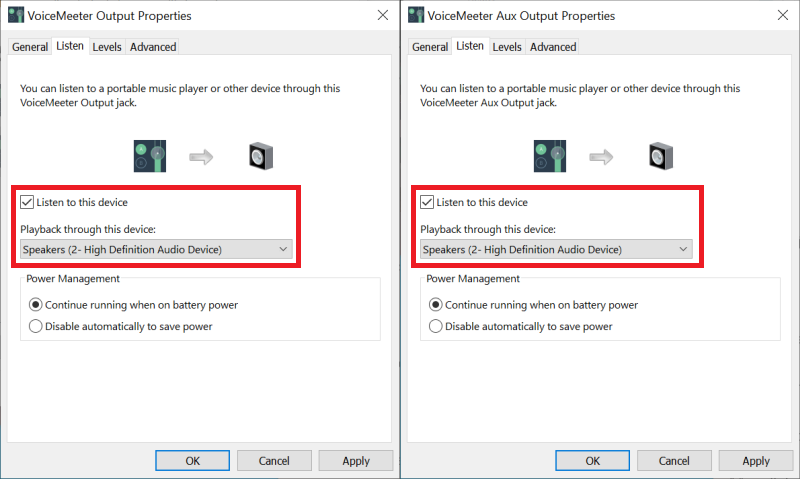

# Kanata 2nd Voice Bot Manual

## Introduction

Kanata 2nd Voice Bot can,

- Recognize your voice and run commands like a smart speaker
- Discord-message-to-speech
- Translate lots of languages
- Play Youtube video

And of course has more features. You can even [develop](https://github.com/knt2nd/knt2-vbot) your own functions/commands with its extensible plugin system.

## Run on local

First of all, try it as a local bot.

1. Press the **START** button  
  
1. **Allow** to use your mic  
  
1. Say something, and see the log says what you said  
  
1. Say "**OK Google, play Hatsune Miku**," and listen music  
  

Tips: An error occurred? That means there's something wrong with the settings, such as API keys. See: [README.md#Get API key](../README.md#get-api-key)

## Connect to Discord

Second, try it as a Discord bot.

1. Go to [Discord Developer Portal](https://discordapp.com/developers/applications/)
1. Click the **New Application** button  
  
1. Input a bot name as you want and **Create**  
  
1. Go to the **Bot** page, and click the **Add Bot** button  
  
1. Click "**Yes, do it!**"  
    
1. Click the **Copy** button to copy your bot token  
    
  Optional: If you don't want anybody add your bot to any server, disable the **PUBLIC BOT** option. It's safer.
1. Back to this app and paste the token  
  

Now the bot can run as a Discord bot, however, nobody can talk with it at the moment. You have to invite it to your server.

1. Go to the **OAuth2** page, and check the **bot** option, and click the **Copy** button to copy URL  
  
1. Paste to your browser address bar and go to there  
  
1. Select the server you want to invite, and click the **Authorize** button  
    
  Tips: If you don't see any server in the select box, that means there's no server you have authorization to add a bot. Just create a new one or ask the server admins you want to add.

Now the server members can talk with your bot.

1. Say something in DM, the bot speaks instead of you
1. Send DM "**!help**" to get the help

## Run on the Internet

Kanata 2nd Voice Bot can run as a smart speaker over the Internet. The setup procedure is a little bit complicated but it's worth it. I'll explain how virtual audio devices work first, and how the bot works in voice chat apps later.

### Virtual audio device

Kanata 2nd Voice Bot needs two pair of virtual playback/recording devices which are connected to each other with a virtual cable. You can get them from [Voicemeeter Banana](https://www.vb-audio.com/Voicemeeter/banana.htm). We don't need the software itself but those virtual audio devices the software has.

After installed Voicemeeter Banana, your audio devices should be like this.  
  
To open these, press Windows key -> paste "mmsys.cpl" -> Enter

VoiceMeeter Input is connected to VoiceMeeter Output. So are VoiceMeeter Aux Input and VoiceMeeter Aux Output. When you play on the playback device, audio goes to the recording device. Set VoiceMeeter Input as a default playback device and play some music. The volume meter indicates it.  

I guess that you already realize what we need to do. Yes, we need an audio cycle flow like this.  

### Second machine or Virtual machine

I highly recommend you to use your second machine for safety, not to accidentally stream audio you don't intend to. If you have no other machine, I recommend a virtual machine. Fortunately, Microsoft distributes [Windows virtual machine images](https://developer.microsoft.com/en-us/windows/downloads/virtual-machines/). I won't explain how to use here, but I'd say that it's extremely useful.

### Audio settings

You have already two pair of virtual playback/recording devices, don't you? The next thing you need to do is change the audio settings.

Go to Windows **Settings** -> **System** -> **Sound** -> **Advanced Sound Options** -> **App volume and device preferences**. When you play audio on Chrome, its name should be there. Then you can change its audio device settings. You have to change like this.  
  
It means that Chrome sends its audio to VoiceMeeter Aux Input and receives audio from VoiceMeeter Output. As for the default audio devices, Output should be VoiceMeeter Input, and Input should be VoiceMeeter Aux Output.

All the settings are fine now. However, you can't listen any sound at the moment. If you want, check the **Listen to this device** option and select a device you want to stream.  

### VRChat settings

Now the bot works in voice chat apps, such as VRChat. Launch the VRChat client, and talk to the bot from the other account. If the bot doesn't respond anything, check the mic setting in the system menu. You can also specify an input source here.  

The following settings are optional but it makes the speech recognition more accurate.  

