# Kanata 2nd Voice Bot マニュアル

## はじめに

Kanata 2nd Voice Botは以下のようなことができます。

- スマートスピーカーのように音声認識→コマンド実行
- Discordメッセージ読み上げ
- 多種多様な言語を翻訳
- Youtube動画を再生

さらに多くの機能があり、拡張性の高いプラグインシステムを用いて新たな機能やコマンドを自分で[開発](https://github.com/knt2nd/knt2-vbot)することもできます。

## ローカルで動かす

まずはローカルボットとして動かしてみましょう。

1. **START**ボタンをクリック  
  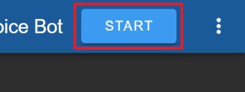
1. マイクを**許可**  
  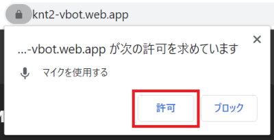
1. 自分の喋った内容がログに出力されることを確認します  
  
1. 「**OK Google、初音ミクを再生して**」と言って音楽を聞いてみましょう  
  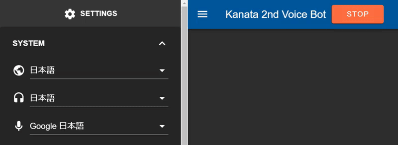

※エラーが発生する場合はAPIキー等の設定を見直してください。参考リンク: [README.md#Get API key](../README.md#get-api-key)

## Discordに接続する

次はDiscordボットとして動かしてみましょう。

1. [Discord Developer Portal](https://discordapp.com/developers/applications/)を開きます
1. **New Application**をクリック  
  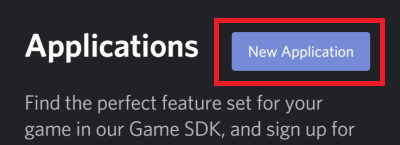
1. ボットの名前を適当に入力し、**Create**をクリック  
  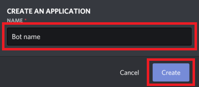
1. **Bot**ページを開き、**Add Bot**をクリック  
  
1. **Yes, do it!** をクリック  
  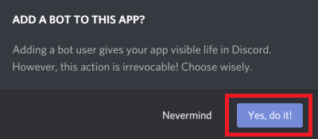
1. **Copy**をクリックし、ボットのトークンをコピーします  
  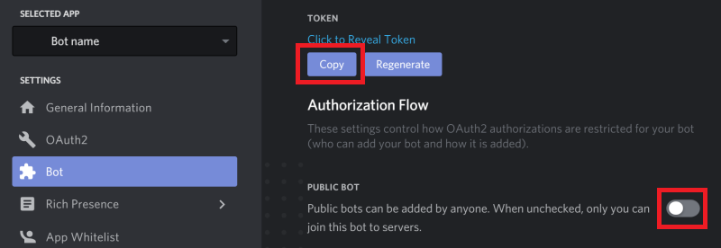  
  必須ではありませんが**PUBLIC BOT**オプションを無効化しておくと、このボットをサーバに追加できるのが自分だけになるので、より安全です。
1. Kanata 2nd Voice Botに戻ってトークンを貼り付けます  
  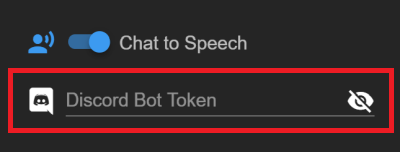

これでDiscordボットとして動作するようになりましたが、現状では誰もボットにメッセージを送れません。どこかのサーバに招待しましょう。

1. **OAuth2**ページを開き、**bot**にチェックを入れ、**Copy**をクリックして承認用URLをコピーします  
  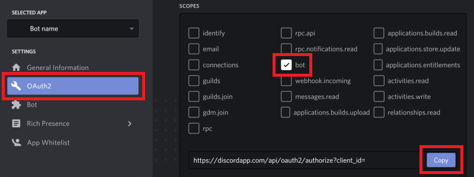
1. ブラウザのアドレスバーに貼り付けてURLを開きます  
  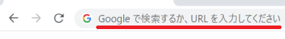
1. ボットを追加したいサーバを選択し、**Authorize**をクリックします  
  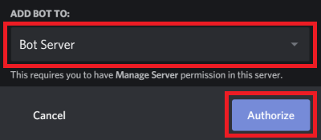  
  サーバが存在しない場合は、新しくサーバを作成するか、ボットを追加したいサーバの管理者に相談してください。

これでサーバのメンバーがボットにメッセージを送れるようになりました。

1. ダイレクトメッセージを送ると、ボットがその内容を読み上げます
1. **!help** コマンドでヘルプを手に入れましょう

## インターネット上で動かす

Kanata 2nd Voice Botはインターネット越しに動作するスマートスピーカーです。セットアップは少し複雑ですが、試す価値はあるでしょう。まず最初に、仮想オーディオデバイスがどのように動作するのかを解説します。その後、このボットを音声チャットアプリ上で動かす方法を解説します。

### 仮想オーディオデバイス

Kanata 2nd Voice Botは仮想ケーブルで接続された2組の仮想再生/録音デバイスを必要とします。これは[Voicemeeter Banana](https://www.vb-audio.com/Voicemeeter/banana.htm)をインストールすることで入手可能です。必要なのはこのソフトウェアそれ自体ではなく、このソフトウェアに付属する仮想オーディオデバイスです。

Voicemeeter Bananaをインストール後、オーディオデバイスは以下のようになっているはずです。  
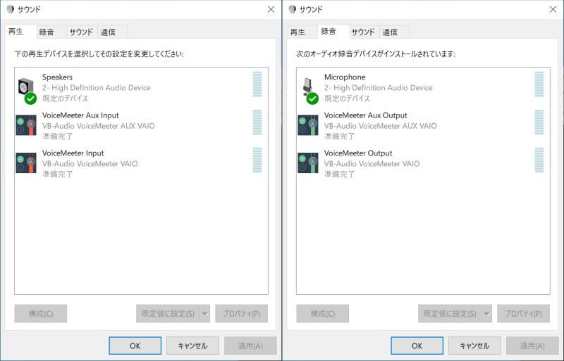  
※Windowsキー → "mmsys.cpl" を貼り付け → Enterでこのウィンドウが開きます

VoiceMeeter InputはVoiceMeeter Outputに、VoiceMeeter Aux InputはVoiceMeeter Aux Outputに接続されており、再生デバイスに流し込まれた音声は対となる録音デバイスに流し込まれます。試しにVoiceMeeter Inputを既定のデバイスに設定してみましょう。この状態で音楽を再生すると、再生デバイスに連動して録音デバイス側の音量メーターも上下しているのが見えるはずです。  
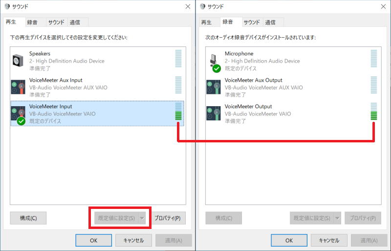

もうお気づきかと思いますが、これからセットアップするのは以下のようなオーディオサイクルです。  
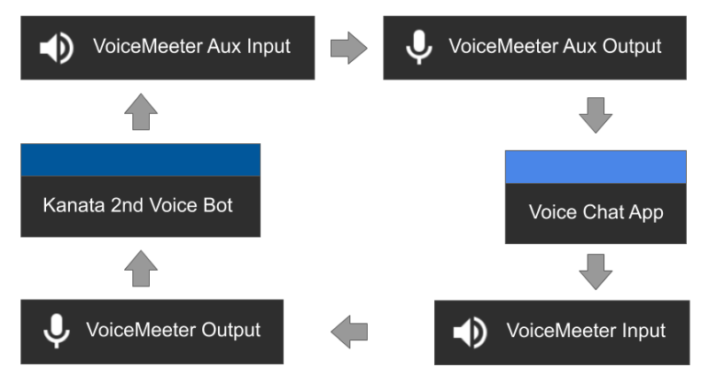

### サブPC or 仮想マシン

意図しない音声が配信される事故を防ぐため、サブPCを使用することを強く推奨します。もしサブPCがない場合でも、仮想マシンを使うことでボット動作環境を完全に分けることができます。Microsoftが[Windowsの仮想マシンイメージ](https://developer.microsoft.com/ja-jp/windows/downloads/virtual-machines/)を配布しています。ここで詳しい解説はしませんが非常に有用なので検討してみてください。

### オーディオ設定

もうすでに2組の仮想再生/録音デバイスは手に入れました。次はオーディオ設定です。

Windowsの**設定** → **システム** → **サウンド** → **サウンドの詳細オプション** → **アプリの音量とデバイスの設定**を開いてください。アプリで音声を再生するとここに名前が出現し、アプリごとのオーディオデバイスを変更できます。ChromeでYoutube動画等を再生し、Chromeの名前が出現したことを確認した後、以下のように変更します。  
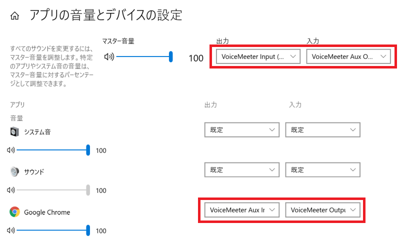  
これでChrome上で再生した音声がVoiceMeeter Auxに流し込まれ、VoiceMeeter Outputのマイク入力をChromeが受け取るようになります。最上段の既定のデバイスは出力をVoiceMeeter Inputに、入力をVoiceMeeter Aux Outputに変更します。

以上ですべての設定が完了しましたが、このままでは音声をモニタリングできません。ボットとして動作させるだけなら必須ではありませんが、**このデバイスを聴く**にチェックを入れ、再生用デバイスを選択することで、モニタリングが可能になります。  
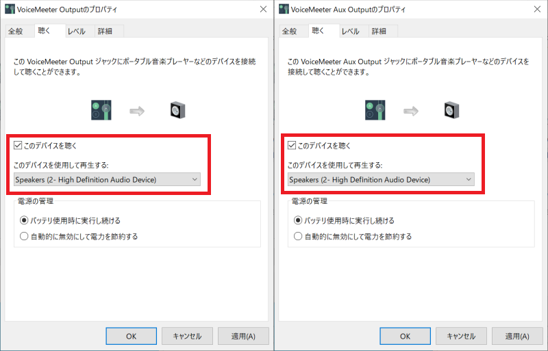

### VRChatの設定

これでKanata 2nd Voice Botはあらゆるボイスチャットアプリで動作するようになりました。試しにVRChatを起動して、別アカウントから話しかけてみましょう。もしボットが反応しない場合は、VRChatクライアントのマイク設定を確認してください。ここからも入力デバイスを指定可能です。  

以下の設定は音声認識の精度を高めるためのものです。  

